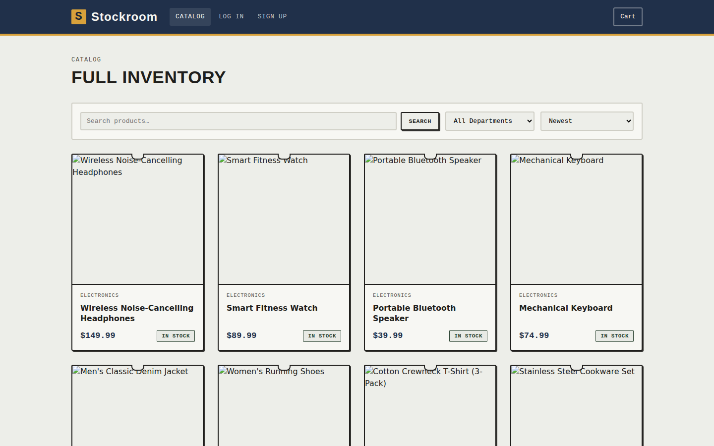
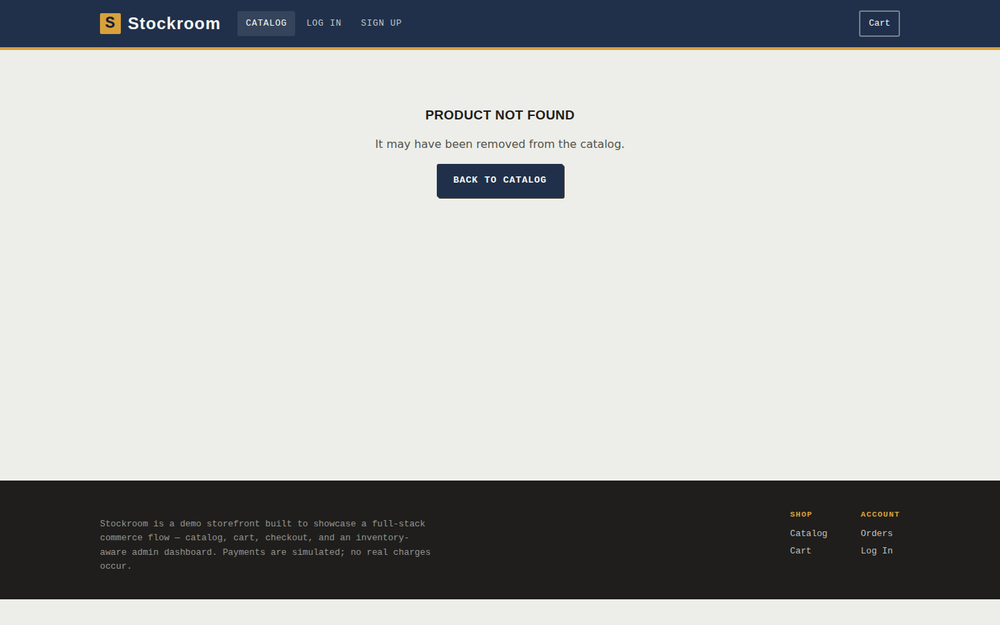
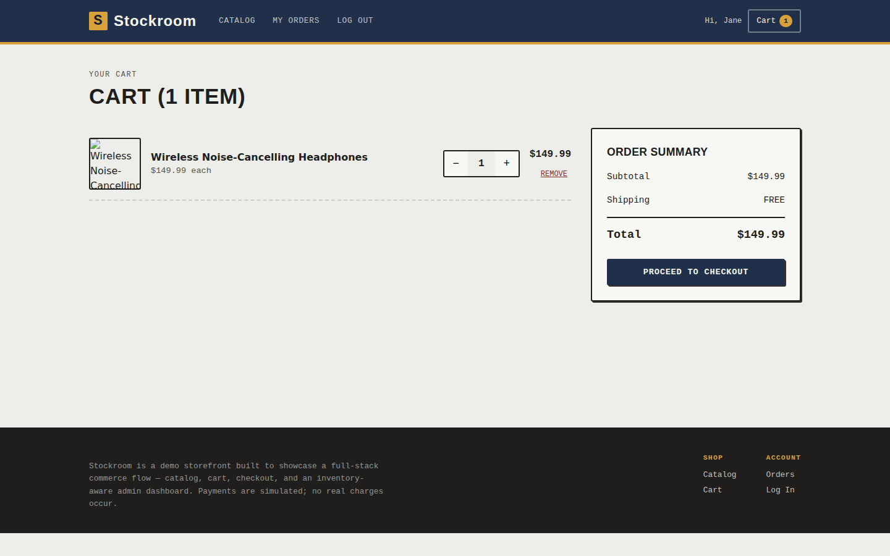
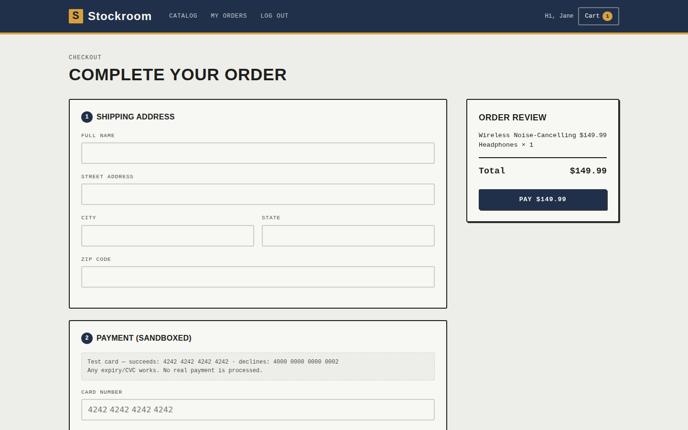
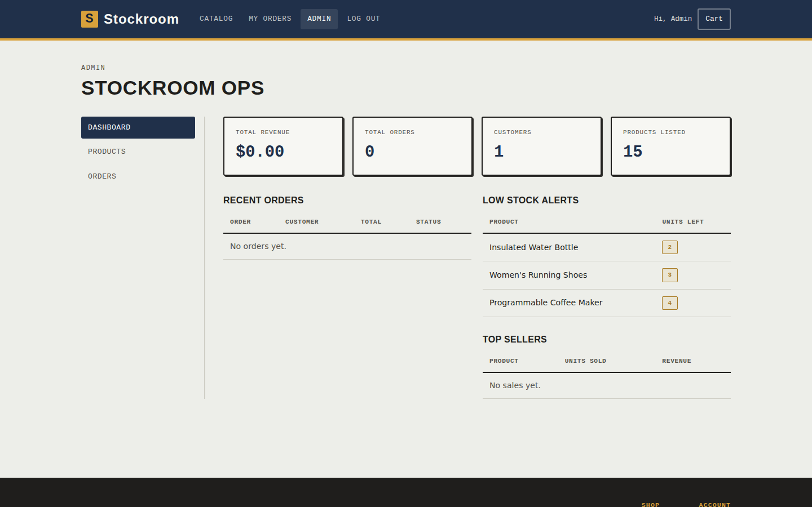
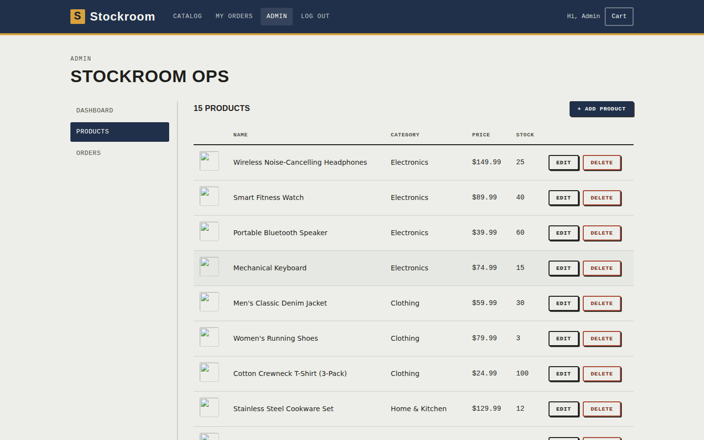

# Stockroom — Full-Stack E-Commerce Platform

A complete e-commerce web app built as a portfolio piece: a React storefront backed by a
Node.js/Express + SQLite API, with authentication, a shopping cart, order management, a
sandboxed Stripe-style payment flow, and an admin dashboard for managing inventory and orders.

> Payments are fully simulated (no Stripe account or real charges required), so the whole
> thing runs out of the box with zero external services.

## Screenshots

**Home page**


**Product catalog** — search, category filter, sort, pagination


**Product detail** — live stock badge, quantity picker


**Cart**


**Checkout** — shipping form + sandboxed payment


**Admin dashboard** — revenue, orders, low-stock alerts, top sellers


**Admin product management**


## Tech Stack

| Layer      | Choice |
|------------|--------|
| Frontend   | React 19 (Vite), React Router, Axios |
| Backend    | Node.js, Express |
| Database   | SQLite (via `better-sqlite3`) — swap for PostgreSQL/MySQL by replacing `backend/src/config/db.js` |
| Auth       | JWT (`jsonwebtoken`) + bcrypt password hashing |
| Payments   | Mock Stripe-style PaymentIntent API (`backend/src/routes/payments.js`) |

## Features

- **Auth** — register/login, JWT-based sessions, bcrypt-hashed passwords, role-based access (customer/admin)
- **Catalog** — search, category filter, sort (price/name/newest), pagination
- **Cart** — add/update/remove items, live stock validation
- **Checkout** — shipping form + sandboxed card payment (test cards below)
- **Orders** — order history for customers; full order + status management for admins
- **Admin dashboard** — revenue/order/customer stats, low-stock alerts, top sellers, product CRUD, order status updates

## Project Structure

```
ecommerce-platform/
├── backend/                 # Express API
│   ├── server.js             # App entry point
│   ├── src/
│   │   ├── config/db.js      # SQLite connection + schema
│   │   ├── middleware/auth.js
│   │   ├── routes/           # auth, products, cart, orders, payments, admin
│   │   └── seed.js           # Demo data seeder
│   └── .env.example
└── frontend/                 # React app (Vite)
    ├── src/
    │   ├── api/client.js      # Axios instance with JWT interceptor
    │   ├── context/           # Auth + Cart React context
    │   ├── components/        # Navbar, ProductCard, route guards, etc.
    │   ├── pages/              # Home, Products, Cart, Checkout, Orders, Admin/*
    │   └── styles/             # Design-token based CSS
    └── .env.example
```

## Getting Started

### 1. Backend

```bash
cd backend
cp .env.example .env
npm install
npm run seed     # creates tables + demo products/users
npm start          # http://localhost:5000
```

### 2. Frontend

```bash
cd frontend
cp .env.example .env
npm install
npm run dev       # http://localhost:5173
```

Open **http://localhost:5173**. The frontend talks to the API at the URL set in
`frontend/.env` (`VITE_API_URL`, defaults to `http://localhost:5000/api`).

### Demo logins (created by the seed script)

| Role     | Email             | Password    |
|----------|-------------------|-------------|
| Admin    | admin@demo.com    | admin123    |
| Customer | customer@demo.com | customer123 |

(The *first* account ever registered is automatically promoted to admin, so you can also
just sign up fresh on a clean database.)

### Test payment cards (mock gateway)

| Card number          | Result   |
|----------------------|----------|
| 4242 4242 4242 4242  | Succeeds |
| 4000 0000 0000 0002  | Declines |
| Any other 16 digits  | Succeeds |

Expiry and CVC can be anything valid-looking (e.g. `12/28`, `123`) — nothing is charged.

## Swapping in a real database or Stripe

- **Database**: `backend/src/config/db.js` contains the schema and connection. To move to
  PostgreSQL/MySQL, swap `better-sqlite3` for `pg`/`mysql2` (or an ORM like Prisma/Sequelize)
  and translate the `CREATE TABLE` statements — the rest of the route files use plain SQL
  through `db.prepare(...)`, so the surface area to change is contained to this one file.
- **Payments**: `backend/src/routes/payments.js` mirrors the shape of Stripe's
  PaymentIntent API on purpose. Swap its contents for the real `stripe` Node SDK
  (`stripe.paymentIntents.create`/`confirm`, plus webhooks) and the frontend checkout flow
  doesn't need to change.

## Notes for reviewers

This was built end-to-end (schema, API, auth, cart logic, payment simulation, admin
dashboard, and the full React frontend) and tested with a scripted browser walkthrough:
register → browse catalog → add to cart → checkout → pay → confirmation → order shows up
in the admin dashboard with inventory correctly decremented.
